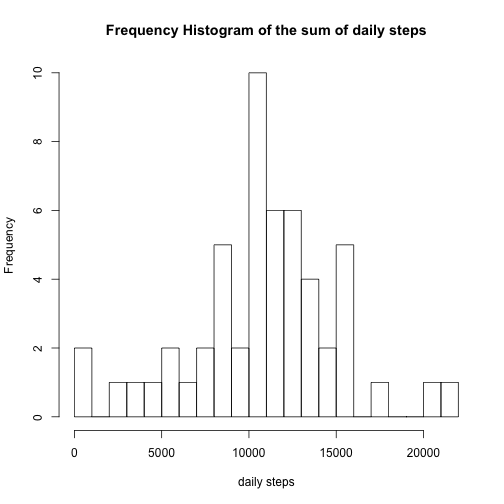
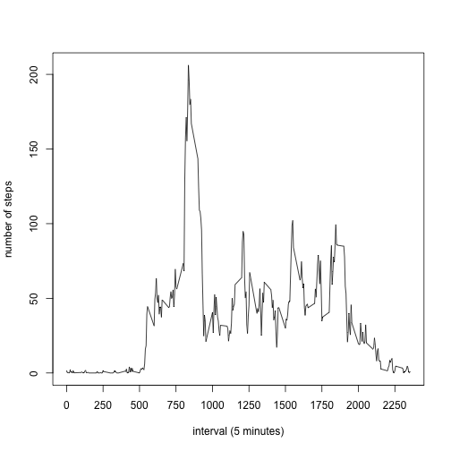
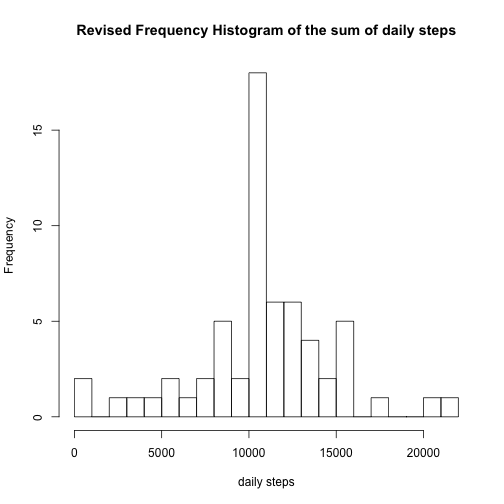
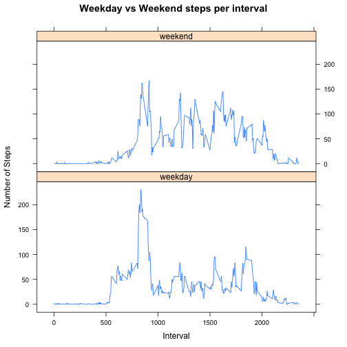

This is an R Markdown document. Is the first peer reviewed assignment in the "Reproducible Data". 
Assignment Instructions can be found at:

https://class.coursera.org/repdata-012/human_grading/view/courses/973513/assessments/3/submissions

<!--- set the working directory and the load the data --->
<!---setwd("/Users/craiganthony/git/RepData_PeerAssessment1")--->

Load the data..


```r
setwd("/Users/craiganthony/git/RepData_PeerAssessment1")
data_in <- read.csv("activity.csv")
activity_data <- na.omit(data_in)
```
Calculate

<!---calulate number of steps per day, average number of steps per day, and the median number of steps per day
mean_daily_steps <- aggregate(activity_data["steps"],by=activity_data[c("date")],FUN=mean,rm.na=TRUE)
median_daily_steps <- aggregate(activity_data["steps"],by=activity_data[c("date")],FUN=median)-->


```r
sum_daily_steps <- aggregate(activity_data["steps"],by=activity_data[c("date")],FUN=sum,rm.na=TRUE)
mean_daily_steps <- mean(sum_daily_steps$steps,na.rm=TRUE)
median_daily_steps <- median(sum_daily_steps$steps,na.rm=TRUE)
```

Here is the total number of steps taken per day.


```r
sum_daily_steps
```

```
##          date steps
## 1  2012-10-02   127
## 2  2012-10-03 11353
## 3  2012-10-04 12117
## 4  2012-10-05 13295
## 5  2012-10-06 15421
## 6  2012-10-07 11016
## 7  2012-10-09 12812
## 8  2012-10-10  9901
## 9  2012-10-11 10305
## 10 2012-10-12 17383
## 11 2012-10-13 12427
## 12 2012-10-14 15099
## 13 2012-10-15 10140
## 14 2012-10-16 15085
## 15 2012-10-17 13453
## 16 2012-10-18 10057
## 17 2012-10-19 11830
## 18 2012-10-20 10396
## 19 2012-10-21  8822
## 20 2012-10-22 13461
## 21 2012-10-23  8919
## 22 2012-10-24  8356
## 23 2012-10-25  2493
## 24 2012-10-26  6779
## 25 2012-10-27 10120
## 26 2012-10-28 11459
## 27 2012-10-29  5019
## 28 2012-10-30  9820
## 29 2012-10-31 15415
## 30 2012-11-02 10601
## 31 2012-11-03 10572
## 32 2012-11-05 10440
## 33 2012-11-06  8335
## 34 2012-11-07 12884
## 35 2012-11-08  3220
## 36 2012-11-11 12609
## 37 2012-11-12 10766
## 38 2012-11-13  7337
## 39 2012-11-15    42
## 40 2012-11-16  5442
## 41 2012-11-17 14340
## 42 2012-11-18 15111
## 43 2012-11-19  8842
## 44 2012-11-20  4473
## 45 2012-11-21 12788
## 46 2012-11-22 20428
## 47 2012-11-23 21195
## 48 2012-11-24 14479
## 49 2012-11-25 11835
## 50 2012-11-26 11163
## 51 2012-11-27 13647
## 52 2012-11-28 10184
## 53 2012-11-29  7048
```

Here is a Histogram of the total number of steps per day.


```r
hist(sum_daily_steps$steps ,main="Frequency Histogram of the sum of daily steps",xlab="daily steps",breaks=20)
```

 

Here is the mean of the number of steps per day from the data frame mean_daily_steps.


```r
mean_daily_steps
```

```
## [1] 10767.19
```
Here is the median of number of steps per day from the data frame median_daily_steps.


```r
median_daily_steps
```

```
## [1] 10766
```
<!--- calculate the mean number of steps per 5 minute interval averaged across all days -->

Here is a line plot of the average number of steps per time interval averaged across all days


```r
mean_time_steps <- aggregate(activity_data["steps"],by=activity_data[c("interval")],FUN=mean)
plot(mean_time_steps$interval,mean_time_steps$steps,type="l",xlab="interval (5 minutes)", ylab="number of steps",xaxp=c(1,2500,11),xaxt='n')
axis(1, at=c(0,250,500,750,1000,1250,1500,1750,2000,2250,2500))
```

 

<!--- find the interval with the maximum number of steps --->


```r
max_step_interval <- subset(mean_time_steps,mean_time_steps$steps==max(mean_time_steps$steps))
max_step_interval$interval
```

```
## [1] 835
```
The interval with the average maximum steps per day for all days is the 835 minute interval.

<!--- Massage the data, first calculate the number of rows with missing data --->

Find the number of rows with missing data.


```r
bad_row_cnt <- nrow(data_in[!complete.cases(data_in),])
bad_row_cnt
```

```
## [1] 2304
```
There are 2304 rows with missing data. Correct this by filling in the missing data with the average number of steps for that interval.

<!--- Insert the mean number of steps per interval into the rows with missing step data for that interval and recalculate stats --->


```r
test <- complete.cases(data_in)
for (i in 1:nrow(data_in)){
    if(test[i] == "FALSE"){
        for (i2 in 1:nrow(mean_time_steps))
            if(data_in$interval[i]==mean_time_steps$interval[i2]){
                data_in$steps[i] = mean_time_steps$steps[i2]
            }
     }
}
sum_daily_steps_new <- aggregate(data_in["steps"],by=data_in[c("date")],FUN=sum,rm.na=TRUE)
mean_daily_steps_new <- mean(sum_daily_steps_new$steps,na.rm=TRUE)
median_daily_steps_new <- median(sum_daily_steps_new$steps)
```
The recalulated mean number of steps per day is 1.0767189 &times; 10<sup>4</sup>

The recalculated median number of steps per day is 1.0767189 &times; 10<sup>4</sup>

The recalculated data did not change from the original

<!--- Plot histogram of new data --->

Here is a histogram of the recalculated data. There was no change in the frequency of average steps.


```r
hist(sum_daily_steps_new$steps ,main="Revised Frequency Histogram of the sum of daily steps",xlab="daily steps",breaks=20)
```

 

<!--- Day of week comparisons --->

Do a weekday/weekend comparison. Create a new datafile. Each is represents interval/mean steps per interval/weekend or weekday. Do a panel plot comparing the weekend and weekday mean steps per interval.


```r
data_in$dow <- weekdays(as.Date(data_in$date))
data_in$dow[data_in$dow == "Saturday"] <- "weekend"
data_in$dow[data_in$dow == "Sunday"] <- "weekend"
data_in$dow[data_in$dow != "weekend"] <- "weekday"

dow_wday <- subset(data_in,data_in$dow=="weekday")
dow_wend <- subset(data_in,data_in$dow=="weekend")

mean_steps_weekday <- aggregate(dow_wday["steps"],by=dow_wday[c("interval")],FUN=mean)
mean_steps_weekend <- aggregate(dow_wend["steps"],by=dow_wend[c("interval")],FUN=mean)

mean_steps_weekend$dow <- "weekend"
mean_steps_weekday$dow <- "weekday"
mean_steps <- rbind(mean_steps_weekday,mean_steps_weekend)
```
Panel Plot.


```r
library(lattice)
attach(mean_steps)
```

```
## The following objects are masked from mean_steps (pos = 4):
## 
##     dow, interval, steps
```

```r
xyplot(steps~interval|dow,main="Weekday vs Weekend steps per interval",xlab="Interval",ylab="Number of Steps",type="l",layout=c(1,2))
```

 

```r
detach(mean_steps)
```

